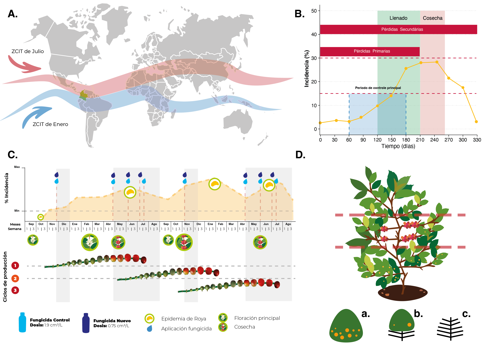

## **Validación de un fungicida, para el control de roya del cafeto en variedad susceptible**

[*Validação do fungicida para o controle da ferrugem do cafeeiro em variedade suscetível*]{style="color:#3aafd0;"}

-   

    ### ***Resumen***

La Roya del Cafeto es una enfermedad económicamente importante para el cultivo del café, causando pérdidas de producción entre el 23% y 50% en Colombia y hasta el 80% en otros países. En Colombia, el 16% de las áreas sembradas con café son susceptibles a esta enfermedad y requieren manejo con fungicidas. Debido a la restricción de muchos agroquímicos, es necesario desarrollar nuevas alternativas de control. Este experimento busca validar un nuevo fungicida como opción en la Estación Experimental La Catalina de Cenicafé, aplicando el producto en dosis específicas en momentos determinados del cultivo. Se evaluarán incidencia, severidad, defoliación y efectos en la producción y calidad del café, comparando con otros tratamientos y sin tratamiento. Los resultados buscarán soportar la recomendación del nuevo fungicida para evitar pérdidas por la roya en Colombia.

[*A Ferrugem do Cafeeiro é uma doença economicamente importante para o cultivo do café, causando perdas de produção entre 23% e 50% na Colômbia e até 80% em outros países. Na Colômbia, 16% das áreas plantadas com café são suscetíveis a essa doença e requerem manejo com fungicidas. Devido à restrição de muitos agroquímicos, é necessário desenvolver novas alternativas de controle. Este experimento busca validar um novo fungicida como opção na Estação Experimental La Catalina de Cenicafé, aplicando o produto em doses específicas em momentos determinados do cultivo. Serão avaliados incidência, severidade, desfolha e efeitos na produção e qualidade do café, comparando com outros tratamentos e sem tratamento. Os resultados buscarão suportar a recomendação do novo fungicida para evitar perdas pela ferrugem na Colômbia.*]{style="color:#3aafd0;"}

-   

    ### ***Planteamento del problema***

Se dispone de pocas alternativas de fungicidas para el control de roya del cafeto y otras enfermedades de importancia en Colombia, con soporte experimental y validadas.

[*Se dispõe de muitas poucas alternativas de fungicidas para o controle da ferrugem do cafeeiro e outras doenças importantes na Colômbia, com suporte experimental e validadas.*]{style="color:#3aafd0;"}

-   

    ### ***Objetivos***

Validar un fungicida, para el control de roya del cafeto en variedad Caturra.

[*Validar um fungicida para o controle da ferrugem do cafeeiro na variedade Caturra.*]{style="color:#3aafd0;"}

## **Generalidades**

-   

    ### Cultivo del Café, la Roya y el Clima

En el cultivo del café en Colombia, una actividad agrícola de gran importancia económica y social, uno de los principales desafíos es la roya del cafeto Hemileia vastatrix. Esta enfermedad afecta las hojas de las plantas de café, reduciendo significativamente la producción, especialmente en variedades susceptibles como Caturra. Por lo tanto, es crucial implementar estrategias efectivas de manejo y control químico.

La Zona de Confluencia Intertropical (ZCIT) (**A.**) juega un papel crucial en el clima de la región cafetera de Colombia. Aquí, la convergencia de vientos alisios del hemisferio norte y sur influye directamente en las precipitaciones y la humedad, variables críticas para el desarrollo de la roya del cafeto.

La efectividad del control químico (**B-C**) es de gran importancia para mitigar los efectos de la roya del cafeto en las variedades susceptibles. Factores como la incidencia, severidad y defoliación (**D**) en el tercio productivo de la planta deben ser evaluados con detalle para implementar estrategias adecuadas.

Estas condiciones ambientales, con temperaturas entre 17 y 29°C (óptimo 22°C), alta humedad relativa (\>90%) y radiación solar moderada, son propicias para el desarrollo de la roya del cafeto, afectando severamente las plantaciones en Colombia. La influencia de la ZCIT en el régimen climático local es, por tanto, fundamental en la respuesta de los cultivos a la enfermedad.

[*No cultivo do café na Colômbia, uma atividade agrícola de grande importância econômica e social, um dos principais desafios é a ferrugem do cafeeiro Hemileia vastatrix. Esta doença afeta as folhas das plantas de café, reduzindo significativamente a produção, especialmente em variedades susceptíveis como Caturra. Portanto, é crucial implementar estratégias eficazes de manejo e controle químico. A Zona de Convergência Intertropical (ZCIT) (A.) desempenha um papel crucial no clima da região cafeeira da Colômbia. Aqui, a convergência dos ventos alísios do hemisfério norte e sul influencia diretamente as precipitações e a umidade, variáveis críticas para o desenvolvimento da ferrugem do cafeeiro. A eficácia do controle químico (B-C) é de grande importância para mitigar os efeitos da ferrugem do cafeeiro nas variedades susceptíveis. Fatores como incidência, severidade e desfolhamento (D) no terço produtivo da planta devem ser avaliados detalhadamente para implementar estratégias adequadas. Essas condições ambientais, com temperaturas entre 17 e 29°C (ótimo 22°C), alta umidade relativa (\>90%) e radiação solar moderada, são propícias para o desenvolvimento da ferrugem do cafeeiro, afetando severamente as plantações na Colômbia. A influência da ZCIT no regime climático local é, portanto, fundamental na resposta das culturas à doença.*]{style="color:#3aafd0;"}

Analysis carried out in the FIP606 Copyrigth Gustavo Marin / Gabriela Rivadeneira © 2024

。いいですか、私たちの神は主おひとりです。
